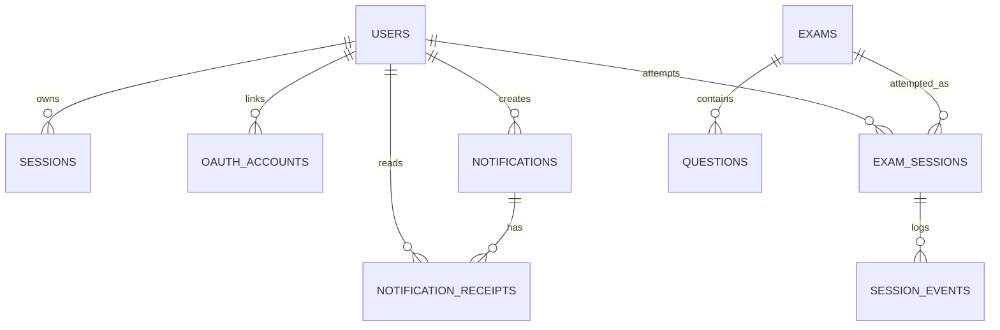

# Database

Production uses Cloudflare D1. `worker/schema.sql` is the complete schema for a new database; `worker/migrations/` are incremental changes for an existing database.

## Relationship Map

Email verification and password reset rows are keyed by email rather than user ID.

## Tables

### `users`

Account and profile data:

- UUID `id`
- unique normalized `email`
- `username`, `first_name`, `last_name`
- `avatar_url`, either provider HTTPS URL or compressed data URL
- `password_hash`
- `verified_at`
- `created_at`
- compatibility `is_premium`, currently unused by product behavior

Admin users have a row so admin sessions can reference a user ID. Admin credential checking still comes from Worker environment settings.

### `oauth_accounts`

Maps `(provider, provider_subject)` to one user. It prevents a provider identity from creating duplicate users and allows profile refresh on later sign-ins.

### `email_verifications`

One hashed six-digit verification code per email with expiry and creation time. Registration upserts this row; verification consumes it.

### `password_resets`

One hashed six-digit reset code per email. Successful reset deletes it and revokes all sessions for that user.

### `sessions`

Opaque Bearer tokens:

- token primary key
- user ID
- exact `student` or `admin` role
- expiry and creation time

Current TTL is 30 days. Expired rows are rejected but are not automatically swept from the table.

### `exams`

Exam metadata:

- string ID generated from title slug plus timestamp
- title and description
- `duration_minutes`
- `is_published`
- created/updated timestamps
- compatibility `price_cents` and `currency`

All current create/update paths force `price_cents = 0`. The student API does not expose price fields.

### `questions`

Ordered MCQ content:

- UUID and parent exam ID
- integer `position`
- type, subject, chapter, topic, instruction
- question text
- `answers_json`, exactly four strings after validation
- `correct_index`, 0-3
- real-number marks
- explanation text and optional explanation image
- optional question image
- built-in `diagram` flag
- timestamps

Question/explanation images are currently stored directly as HTTPS URLs or Base64 data URLs. This is convenient but object storage such as R2 is better for large-scale media.

### `exam_sessions`

One student attempt:

- attempt UUID, exam ID, and user ID
- unique six-character pairing code
- phone connected, started, submitted timestamps
- result email due/sent timestamps
- result release timestamp
- stored earned/total score
- answers and flags JSON
- created/updated timestamps

There is no recording/media table. Migration `0006` removed the old unused `media_objects` table.

### `session_events`

Timestamped attempt events with a bounded `event_type` and JSON payload. Examples include setup completion, phone connection, exam start/submission, focus loss, and blocked shortcuts. These are audit/simulation events, not recordings.

### `notifications`

Admin-created broadcasts with title, body, kind, audience, creator, and timestamp.

### `notification_receipts`

Composite key `(notification_id, user_id)` with `read_at`. This lets the API return per-student read state without copying notifications.

## JSON Fields

The application uses JSON strings in D1 for arrays/maps that are naturally loaded as one value:

- `questions.answers_json`: four options
- `exam_sessions.answers_json`: question UUID -> selected option index
- `exam_sessions.flags_json`: array of flagged question UUIDs
- `session_events.payload_json`: small event metadata

Worker helper `parseJson()` always supplies a safe fallback.

## Deletion and Retention

- Deleting a user cascades OAuth accounts and notification receipts. Other user relationships are not uniformly configured with cascade and should be deleted deliberately in a future account-deletion implementation.
- Deleting an exam through the API first removes linked events and attempts, then questions and exam.
- Creating a new attempt prunes attempts older than the newest 50 for that user.
- Result lists return the newest 50 submitted attempts.
- Notification and expired-token retention currently has no scheduled cleanup.

## Indexes

Important indexes support question ordering, session authentication, attempt ordering, leaderboard score lookup, OAuth user lookup, and notification ordering.

## Migration History

- `0001`: correct answer index
- `0002`: result email schedule
- `0003`: marks
- `0004`: explanations and explanation image
- `0005`: usernames
- `0006`: remove unused media table
- `0007`: profile, OAuth, notifications, taxonomy
- `0008`: stored analytics scores and leaderboard index
- `0009`: notification kind
- `0010`: password resets
- `0011`: immediate result release plus compatibility monetization columns
- `0012`: force every existing exam free

For production, never rerun an `ALTER TABLE ADD COLUMN` migration. Track which numbered migration has already been applied.
