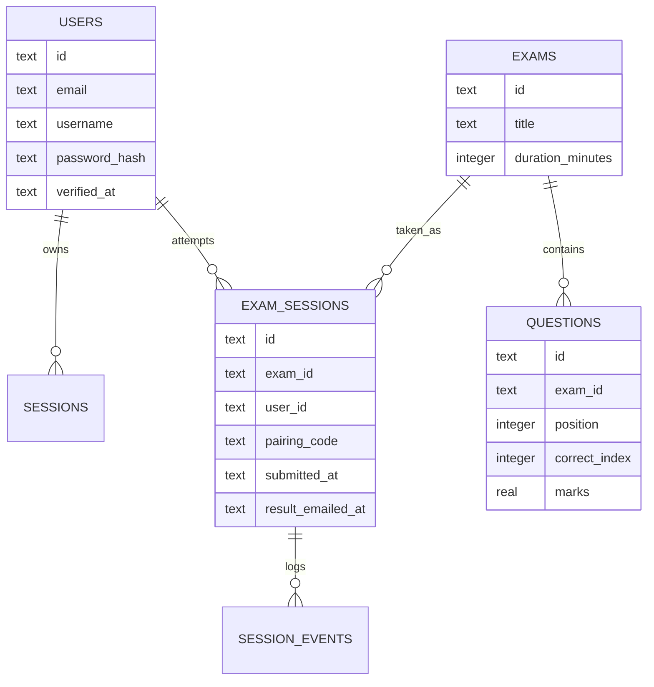

# Database

The production database is Cloudflare D1. The main schema lives in `worker/schema.sql`, with incremental migrations in `worker/migrations/`.

## Tables

### `users`

Stores student and admin user records.

Important columns:

- `id`: UUID primary key.
- `email`: unique login email.
- `username`: display name shown in the dashboard.
- `first_name`, `last_name`: student profile fields.
- `avatar_url`: provider URL or compressed profile image.
- `password_hash`: SHA-256 hash of `PASSWORD_PEPPER:password`.
- `verified_at`: null until email verification succeeds.
- `created_at`: ISO timestamp.

Admin accounts also get rows in this table, but admin login is checked against environment variables, not this table's password hash.

### `email_verifications`

Stores pending email verification codes.

Important columns:

- `email`: primary key.
- `code_hash`: hashed six-digit code.
- `expires_at`: verification expiry.
- `created_at`: timestamp.

Codes currently expire after 15 minutes.

### `sessions`

Stores login tokens.

Important columns:

- `token`: Bearer token used by the frontend.
- `user_id`: linked user.
- `role`: either `student` or `admin`.
- `expires_at`: token expiry.
- `created_at`: timestamp.

Tokens currently last 30 days.

### `exams`

Stores exam papers.

Important columns:

- `id`: slug plus timestamp.
- `title`
- `description`
- `duration_minutes`
- `is_published`
- `created_at`

### `password_resets`

Temporary hashed password recovery codes keyed by email. Each row has an expiry timestamp and is deleted after a successful reset.
- `updated_at`

Student exam lists only return published exams. Admin lists return all exams.

### `questions`

Stores MCQ questions.

Important columns:

- `id`: UUID.
- `exam_id`: parent exam.
- `position`: order in the exam.
- `type`: currently usually `Single choice`.
- `subject`, `chapter`, `topic`: taxonomy fields used by weakness analysis.
- `instruction`: instruction text shown above the question.
- `text`: question body.
- `answers_json`: JSON array of four answer options.
- `correct_index`: number from 0 to 3.
- `marks`: score value for this question.
- `explanation_text`: answer explanation.
- `explanation_image_url`: optional explanation image.
- `image_url`: optional question image.
- `diagram`: boolean integer for the built-in disk diagram.

Current admin image upload uses browser `FileReader` data URLs, so these image fields may contain base64 data URLs. This works only for small images because the Worker limits JSON request size.

### `exam_sessions`

Stores one student's attempt at one exam.

Important columns:

- `id`: UUID session/attempt id.
- `exam_id`
- `user_id`
- `pairing_code`: code shown in the phone QR flow.
- `phone_connected_at`: set when the phone page calls `/pair-phone`.
- `started_at`: currently present but not heavily used by the frontend.
- `submitted_at`: set when the exam is submitted.
- `result_released_at`: the immediate result-release timestamp.
- `result_email_after`: the email queue timestamp, set to submission time for immediate delivery attempts.
- `result_emailed_at`: set when the result email is sent/released.
- `answers_json`: object of question id to selected option index.
- `flags_json`: array of flagged question ids.
- `created_at`
- `updated_at`

The Worker prunes old sessions and keeps only the latest 10 attempts globally. That matched an earlier lightweight-retention idea. If Crossline needs long-term student history, increase or remove `MAX_STORED_EXAM_SESSIONS` in `worker/src/index.js`.

### `session_events`

Stores attempt events.

Examples:

- `phone_connected`
- `room_scan_completed`
- `exam_started`
- `exam_submitted`
- `integrity_event`

This is useful for admin review and for reconstructing the setup timeline of an attempt.

## Migrations

Existing migrations are in `worker/migrations/`. Apply only the migrations needed for the target database, and do not reset production data just to match a fresh schema file.

The `worker/schema.sql` file represents the current full schema for a fresh database. For an existing production DB, use migrations carefully instead of blindly resetting data.

## Data Relationships

## Practical Notes for Frontend Work

- `answers_json` uses backend question IDs, not just visible question numbers.
- The frontend normalizes backend question `id` into `backendId` and uses `id: index + 1` for display.
- Results can be pending. Do not assume every submitted exam has question details available.
- Admin-created images are currently inline data URLs. Keep them small or build a real image-upload path.
### `oauth_accounts`

Links a Google or Facebook provider subject ID to a `users` record.

### `notifications` and `notification_receipts`

Admins create broadcast notifications for students. A receipt records whether a student has read each notification.

### `exam_sessions`

In addition to answers, timing, and pairing data, a submitted session stores `score_earned` and `score_total`. This avoids recalculating a full paper for common results and leaderboard requests. Retention is capped at 50 attempts per student, not globally.
