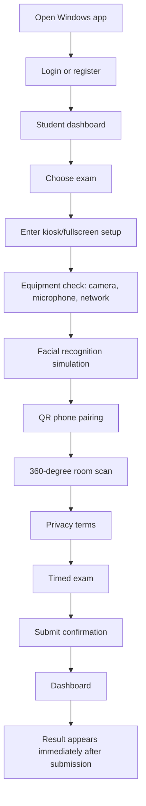

# System Map

The app is made of four practical layers.

## 1. Windows Exam Client

Code:

- `src/index.html`
- `src/app.js`
- `src/api.js`
- `src/config.js`
- `src/styles.css`
- `electron/main.js`
- `electron/preload.js`
- `electron/github-updater.js`

This is the software students install and use. It is an Electron app that loads the local files in `src/`. The UI is mostly built by replacing `app.innerHTML` inside `src/app.js`. There is no React/Vue framework here.

The Electron wrapper adds Windows-app behavior:

- normal login/dashboard window at launch
- kiosk/fullscreen only after the student starts exam setup
- focus guard while in exam/setup mode
- blocked shortcuts such as Alt+Tab, Alt+F4, F5, F12
- media permissions for webcam and microphone
- content protection hint
- auto-update IPC bridge

Security note: this is a practice/mock exam client. The kiosk layer makes the experience feel controlled, but it is not the same as a locked-down institutional exam lab.

## 2. Cloudflare Worker API

Code:

- `worker/src/index.js`
- `worker/wrangler.toml`

The Worker is the production backend. It handles:

- student registration
- verification emails
- student login
- admin login
- exam listing
- admin exam/question creation
- student exam sessions
- phone QR pairing
- answer saving
- result scoring
- immediate result release and queued result emails
- admin submission review

The app talks to it through `window.CrosslineApi` in `src/api.js`. The production API base URL is configured in `src/config.js`:

```js
window.CROSSLINE_API_BASE = "https://api.crosslinecscatest.com";
```

## 3. Cloudflare D1 Database

Code:

- `worker/schema.sql`
- `worker/migrations/*.sql`

D1 stores the real application data:

- users
- verification codes
- login sessions
- exams
- questions
- exam attempts
- event logs
- answers and flags

The full schema is explained in [Database](database.md).

## 4. Downloads and Updates

Code:

- `media-server/server.js`
- `media-server/README.md`

The VPS serves the Windows installer used by the website download button and `latest.json` used by the equipment network test. Application updates are published as public GitHub Releases and checked through `electron-updater`.

Typical public URLs:

- `https://media.crosslinecscatest.com/downloads/Crossline-CSCA-Practice-Setup.exe`
- `https://media.crosslinecscatest.com/updates/latest.json`

Each GitHub Release contains `latest.yml`, a versioned NSIS installer, and its versioned `.blockmap` file.

## High-Level Student Flow



## Website vs App

When `window.examRuntime` exists, the code is running inside Electron and shows the student app.

When `window.examRuntime` does not exist, the same `src/index.html` behaves like a landing page and shows a download button instead of login/exam pages. This is handled at the bottom of `src/app.js`:

```js
if (isDesktopClient()) {
  showAuth();
} else {
  showDownloadLanding();
}
```
