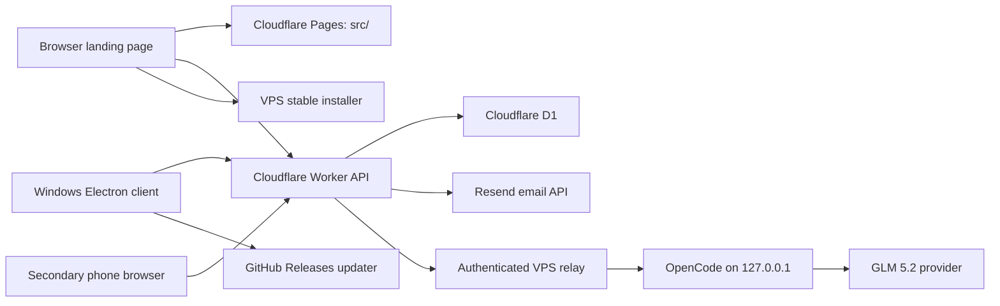
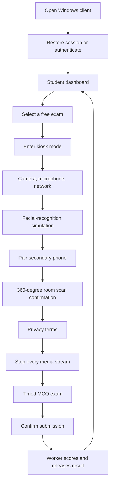

# System Map

## Deployed Architecture

## Component Boundaries

### Shared web frontend

`src/` is deployed to Cloudflare Pages and bundled into Electron. The same HTML, CSS, and JavaScript select a different entry screen at runtime:

- `window.examRuntime` exists: Electron client, login, dashboard, exams, and admin tools.
- `window.examRuntime` is absent: public landing page, account registration/verification, and legal pages.

The UI is vanilla JavaScript. Screen functions replace `#app` with HTML and then attach listeners. There is no React, Vue, router package, or frontend build step.

### Electron main process

`electron/main.js` owns operating-system capabilities that the sandboxed renderer cannot use directly:

- window creation and kiosk/fullscreen state
- focus guard and blocked keyboard shortcuts
- camera and microphone permission policy
- CSP headers for local files
- Google OAuth child window
- local file extraction/OCR IPC
- updater IPC
- controlled app exit

`electron/preload.js` exposes a narrow `window.examRuntime` API through `contextBridge`. Node integration is disabled, context isolation and the Chromium sandbox are enabled.

### Cloudflare Worker

`worker/src/index.js` is a single Worker containing routing, validation, authorization, D1 queries, result scoring, phone pairing, email delivery, and AI relay calls. `src/api.js` is the renderer-side wrapper around those routes.

### D1

D1 stores accounts, OAuth links, bearer sessions, exams, questions, attempts, answers, setup/security events, notifications, and notification receipts. Media recordings do not exist in the schema.

### VPS

The VPS has two unrelated jobs behind Caddy:

- serve the stable Windows installer and transition update files
- run the private OpenCode service and an authenticated relay

OpenCode and its relay listen only on loopback. Caddy exposes `/admin-ai/*`, but the relay rejects requests without the shared secret that only the Worker knows.

### GitHub Releases

Installed clients from `0.1.35` onward use `electron-updater`. GitHub releases provide `latest.yml`, the versioned NSIS installer, and a versioned blockmap. Differential downloads are attempted first; a full installer download is the supported fallback.

## Student Flow

## AI Import Flow

The chat route and the deploy route are deliberately separate. A model reply cannot directly modify D1.
