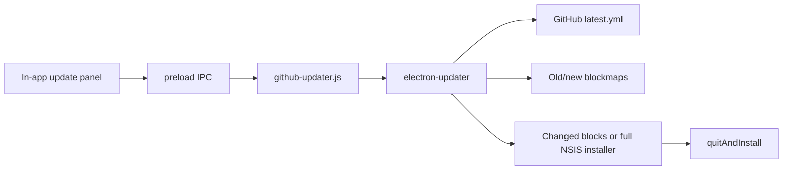

# Updates and Releases

Version `0.1.35` moved the installed client to `electron-updater` and public GitHub Releases.

## Runtime Update Flow



`electron/main.js` initializes the updater before creating the window and checks 1.2 seconds after the renderer loads. The renderer also supports manual checks and a daily auto-update preference.

## Updater Configuration

`electron/github-updater.js` sets:

- `autoDownload = false`
- `autoInstallOnAppQuit = true`
- `autoRunAppAfterInstall = true`
- prereleases disabled
- differential downloads enabled

It normalizes updater events into renderer events:

- `checking`
- `available`
- `not-available`
- `starting`
- `downloading` with percentage/bytes/s
- `downloaded`
- `installing`
- `error`
- `reset`

The update prompt and progress bar stay inside the app, avoiding an inaccessible native dialog behind kiosk/always-on-top behavior.

## Differential Download Reality

Every release must contain:

- `latest.yml`
- `Crossline-CSCA-Practice-Setup-<version>.exe`
- `Crossline-CSCA-Practice-Setup-<version>.exe.blockmap`

The version in the filename is required so the updater can derive the previous blockmap URL. Electron-updater compares blockmaps and downloads changed ranges when possible. It is allowed to fall back to the complete installer if the previous blockmap/cache/range request cannot support a patch.

This is block-level differential download, not a custom source-code patch format.

## Renderer Behavior

`src/app.js` owns:

- update panel rendering
- manual check button
- download confirmation
- progress display
- restart/install button
- error/reset state
- `csca-auto-update` preference
- once-per-day launch check timestamp

Update controls are shown on login/dashboard/settings surfaces, not inside the timed exam.

Before `quitAndInstall`, the adapter permits close and stops the focus guard. NSIS updates the existing installation and relaunches the app.

## Installer

`electron-builder` creates a per-user assisted NSIS installer. Normal interactive install:

- asks for install directory
- asks about Desktop shortcut
- asks about Start Menu and uninstall shortcut
- closes only the named Crossline process
- supports repair when an older uninstaller is damaged
- uses the Crossline icon for app/installer/uninstaller

Silent updater installs preserve existing shortcuts. They do not run the interactive shortcut page or create duplicate shortcuts.

## GitHub Publishing

`package.json` publishes to:

```text
arijitcrossline-hue/crossline-csca-practice-client
```

`.github/workflows/release.yml` runs on tags matching `X.Y.Z`. It uses Windows, Node 22, `npm ci`, verifies the tag equals the package version, then executes `npm run release:github` with `GITHUB_TOKEN`.

Release procedure:

1. Update version in `package.json` and lockfile.
2. Run tests.
3. Commit and push `main`.
4. Create the exact pure-semver tag, without `v`.
5. Push the tag.
6. Wait for the Windows release workflow.
7. Verify all three required assets and public download URLs.
8. Copy the versioned installer to the VPS stable website filename.

## Website Installer

The landing page always downloads:

```text
https://media.crosslinecscatest.com/downloads/Crossline-CSCA-Practice-Setup.exe
```

This stable filename is separate from GitHub's versioned updater artifact. `scripts/build-update-patch.mjs` copies the versioned local installer to that stable filename. Production deployment must update the VPS file atomically.

## Pre-0.1.35 Transition Bridge

Clients before the GitHub migration used `latest.json` plus a custom ZIP containing `resources/app.asar`. `electron/update-helper.js` and `scripts/build-update-patch.mjs` support the one-time crossover to `0.1.35`. Current `electron/main.js` does not import that helper; current clients use GitHub only.

Keep the bridge files available while old installations may still exist. Do not use the custom ZIP for new releases.

## Common Update Failures

- Tag and package version differ: workflow intentionally fails.
- Missing/versionless blockmap: differential URL resolution fails and may force full download.
- Installer asset renamed by hand: `latest.yml` no longer matches.
- Release is draft/prerelease: stable clients will not select it.
- App in kiosk during restart: install handler must stop focus guard first.
- Website still serves old installer: new installations start from an old version despite GitHub being correct.
- Unsigned installer: Windows SmartScreen warnings remain likely. Code signing is the proper production fix.
